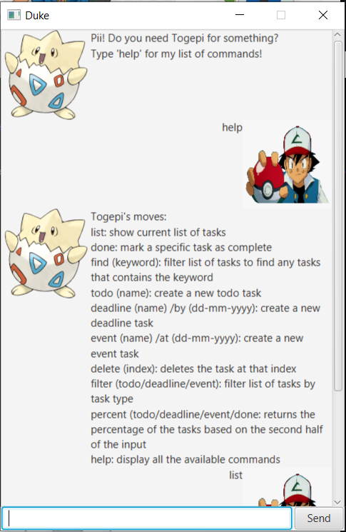

# Personal Assistant Togepi - User Guide

## 1. Introduction

Personal Assistant Togepi (PAT) is for those who *prefer to use a desktop app for managing your tasks*. More importantly, PAT is *optimized for those who prefer to work with a Command Line Interface* (CLI), so if you can type fast, PAT can get your manage your tasks faster than traditional GUI apps.

## 2. Quick Start

2.1 Ensure you have Java `11` or above installed in your Computer.

2.2 Download the latest `duke-0.2.jar` [here](https://github.com/phaebaez/duke/releases/download/0.2/duke-0.2.jar)

2.3 Copy the file to the folder you want to use as the home folder for your Personal Assistant Togepi.

2.4 Start up the application. It should look as follows: 

2.5 Type the command in the command box and press <kbd>Enter</kbd> to execute it.  
E.g. typing *`help`* and pressing <kbd>Enter</kbd> will open the help window.

2.6 Some example commands you can try:

* `list` : lists all the tasks in the library 
* `todo` `n/homework`: adds a todo with the description `homework` to the library.
* `delete` `3` : deletes the 3rd task shown in the current list
* `bye` : exits the app

## 3. Features 

### 3.1 Showing help

Displays a list of all the available commands. 
Format: `help` 

### 3.2 Adding todos

Add tasks that the user needs *todo*.
Format: `todo n/DESCRIPTION`

Examples:

* `todo n/study for midterms`  
Returns a new *todo* with the description `study for midterms`.  
Displays the message `Togepi has found something and added it to her storage: [T] x study for midterms Now you have x tasks in your list`.

### 3.3 Adding deadlines

Add tasks that the user needs to complete by a certain *deadline*.
Format: `todo n/DESCRIPTION /by d/DATE`

Examples:

* `deadline n/assignment 0 /by 2/12/2020`  
Returns a new *deadline* with the description `assignment 0`.  
Displays the message `Togepi has found something and added it to her storage: [D] x assignment 0 (by Dec 2 2020) Now you have x tasks in your list`.

### 3.4 Adding event

Add *events* that the user needs to attend on a certain date.
Format: `todo n/DESCRIPTION /at d/DATE`

Examples:

* `event n/marathon /by 4/4/2020`  
Returns a new *event* with the description `marathon`.  
Displays the message `Togepi has found something and added it to her storage: [E] x marathon (at April 4 2020) Now you have x tasks in your list`.

### 3.4 Finding tasks

Finds tasks that contain the specific KEYWORD in the description.
Format: `find KEYWORD`

Examples:

* `find study`  
Returns all tasks with descriptions containing `study`.  
Displays the message `Togepi has found something and added it to her storage: [E] x marathon (at April 4 2020) Now you have x tasks in your list`.

### 3.6 Marking task as completed 

Marks a specified task as completed
Format: `done INDEX`

* Marks the task at the specified INDEX as completed. The index refers to the index number shown in the complete list of decks.  
The index must be a positive integer 1, 2, 3, …

Examples:

* `list`  
`done 2`  
Marks the second task on the list as completed.  
Displays the message `Togepi used Metronome! It' super effective [D][✓] return book (by: Jun 6 2019)`
* `find read`  
` done 1`  
Marks the first task on the filtered list as completed.  
`Togepi used Metronome! It' super effective [T][✓] read book`

### 3.7 Displaying statistics 

Displays percentage of tasks in the list that are of a certain type. 
Format: `percent TYPE` 

* TYPE can only be: `todo`, `deadline`, `event` or `done`. 
* Percentage is calculated based on *how many of the tasks are of the type* over *the total number of tasks in the list* 
